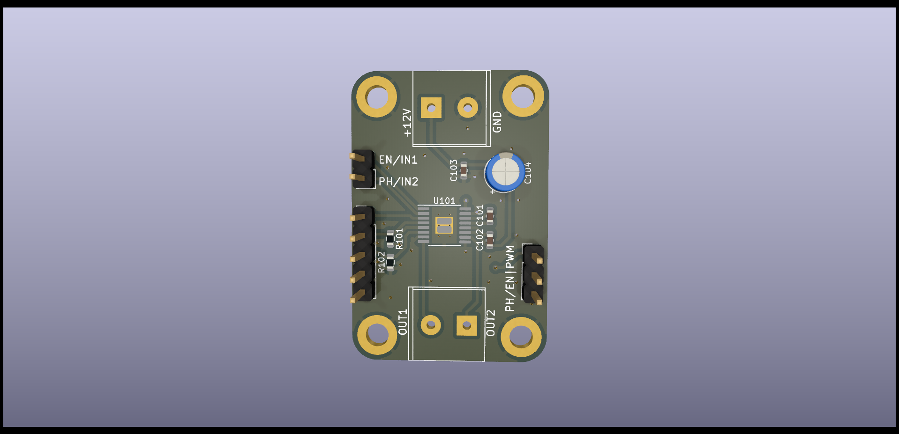

# Motor Controller DRV8874

The Motor Controller, harnessing the power of the DRV8874 H-bridge motor driver by Texas Instruments, offers a top-of-the-line solution for managing small to large DC motors. This compact yet potent device presents an expansive operating supply voltage range of 4.5V to 37V, assuring adaptability with diverse power inputs. It is capable of delivering a peak current of up to a remarkable 6A, ensuring smooth and efficient motor operations even under strenuous conditions. Armed with advanced safety and protection features including overcurrent, thermal, undervoltage, and even charge pump undervoltage, the motor controller prioritizes your motor's durability and reliable performance. Whether your project involves creating a versatile home appliance, an interactive toy robot, or an advanced servo motor system, this motor controller delivers effortless integration and superior performance, empowering your projects with precision and power.

## Features
- PWM control
- PH/EN control
- Motor Voltage 4.5V to 37V
- Peak current 6A
- Current limit 6A
- PWM frequency upto 100 kHz
- 200-mΩ (High-Side + Low-Side)
- Dimensions 27 mm x 40 mm
- Mounting hole diameter 3.2 mm
- Integrated current sensing and regulation
- Undervoltage lockout
- Charge pump undervoltage
- Overcurrent protection
- Thermal shutdown
- Automatic fault recovery
- Fault indicator pin (nFAULT)
Note: For more information refer to DRV8874 datasheet.

## Control Modes

The DRV8874 Breakout Board supports two different control modes: PH/EN and PWM. The PH/EN mode uses the PH and EN pins to control the motor, while the PWM mode uses the IN1 and IN2 pins and PWM signals to control the motor.

To switch between the control modes, you need to change the position of the "PH/EN|PWM" jumper on the board. When the jumper is in the PH/EN position, the board is in PH/EN mode. When the jumper is in the PWM position, the board is in PWM mode.

## Arduino Examples

* [PWM Control](./exampes/PWMControl/PWMControl.ino)
* [PH/EN Control](./exampes/PHENControl/PHENControl.ino)
* [Current Sensing](./exampes/CurrentSensing/CurrentSensing.ino)

## Resources

- [Texas Instruments DRV8874](https://www.ti.com/lit/ds/symlink/drv8874.pdf?ts=1678750825020&ref_url=https%253A%252F%252Fwww.ti.com%252Fproduct%252FDRV8874)